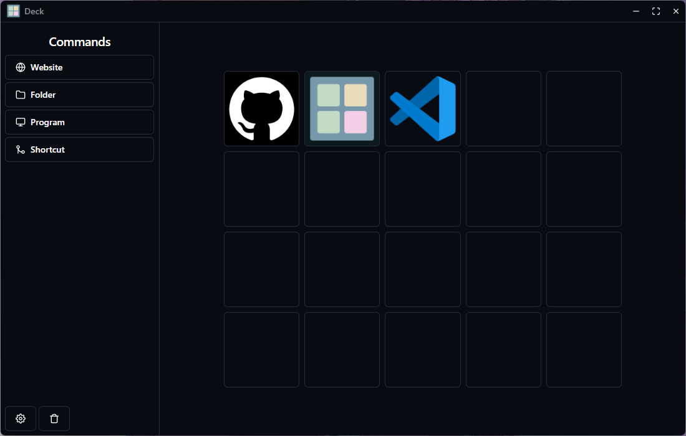

# 💻 Deck

This is a application that allows you to use your smartphone as a control pad for your computer, launching programs and sites, using hotkeys and more.

<p align="center">
  
  <span>Project Interface</span>
</p>

<p align="center">
  
  
  
</p>

## 📂 Boilerplate

This project was bootstrapped with [Electron React Boilerplate](https://electron-react-boilerplate.js.org/).

## 💻 Technologies

* [Node](https://nodejs.org/en/)
* [React](https://reactjs.org/)
* [Electron](https://www.electronjs.org/)

## 🏃 Getting Started

First, clone this repository and access the created folder:

```bash
# Cloning repository
git clone https://github.com/iamtheluiz/deck.git

cd deck/
```

Inside the folder, install all project dependencies:

```bash
npm install
# or
yarn install
```

## 👨🏽‍💻 Usage

To run this project in a local environment use:

```bash
npm run start
# or
yarn start
```

## ⚙️ Package

To create a package of this project, run:

```bash
npm run package
# or
yarn package
```

Await the script and you will have all generated files inside the "release/build" folder.

## 💼 Authors

* **Luiz Gustavo** - *Development* - [iamtheluiz](https://github.com/iamtheluiz)
  * Website: https://iamtheluiz.github.io
  * Github: [@iamtheluiz](https://github.com/iamtheluiz)
  * LinkedIn: [Luiz Gustavo da Silva Vasconcellos](https://www.linkedin.com/in/luiz-gustavo-da-silva-vasconcellos-05192a192?lipi=urn%3Ali%3Apage%3Ad_flagship3_profile_view_base_contact_details%3BbQkVQ3sTTv6XCn%2FiToGGcA%3D%3D)
